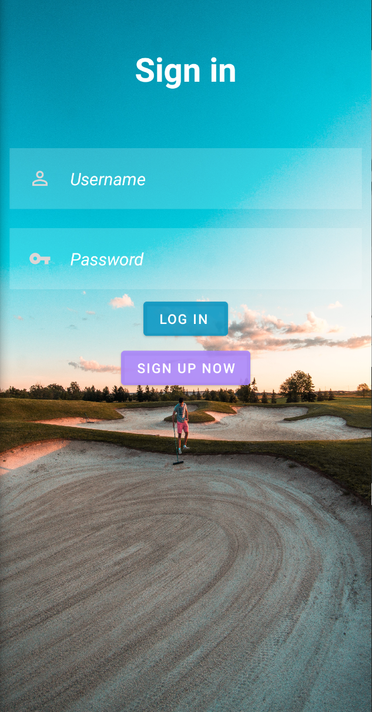
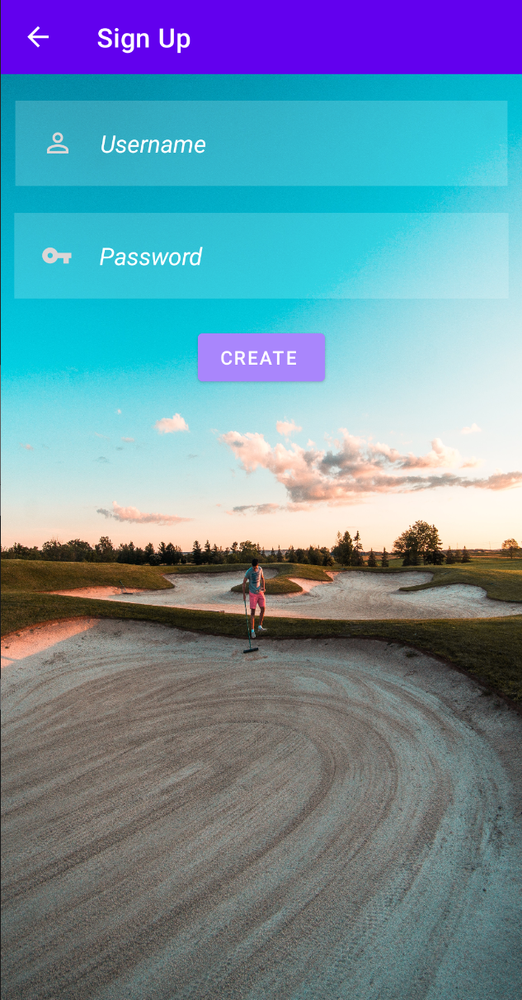
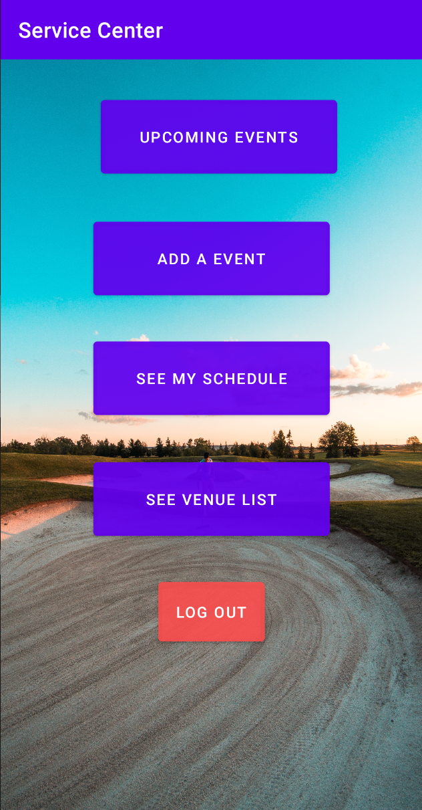
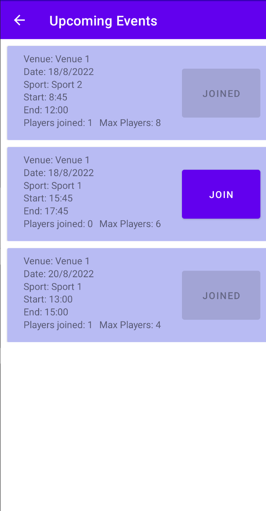
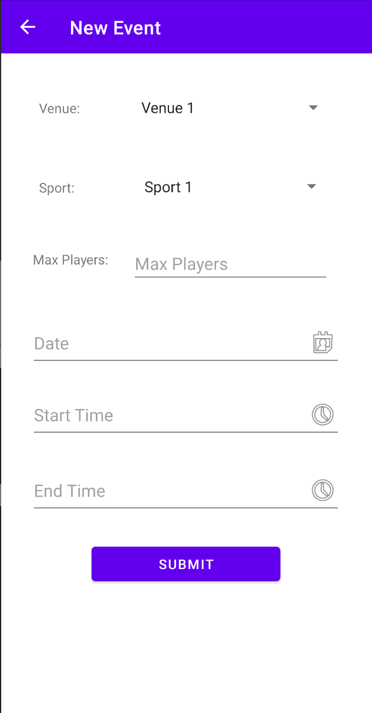
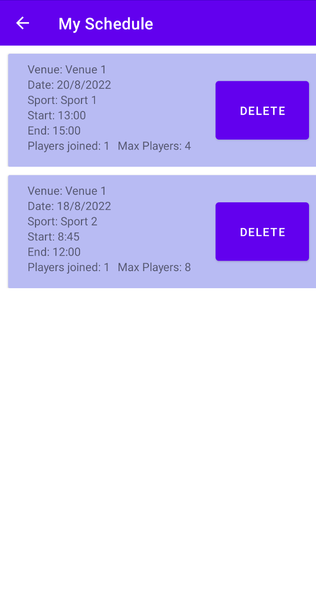
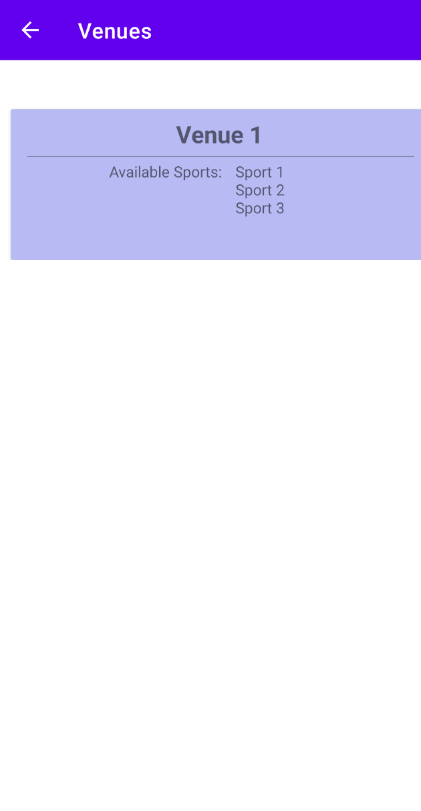
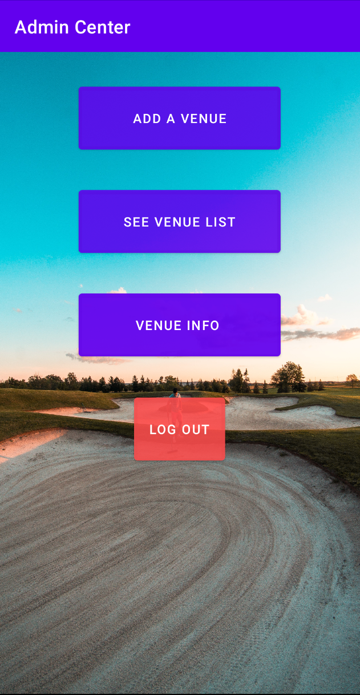
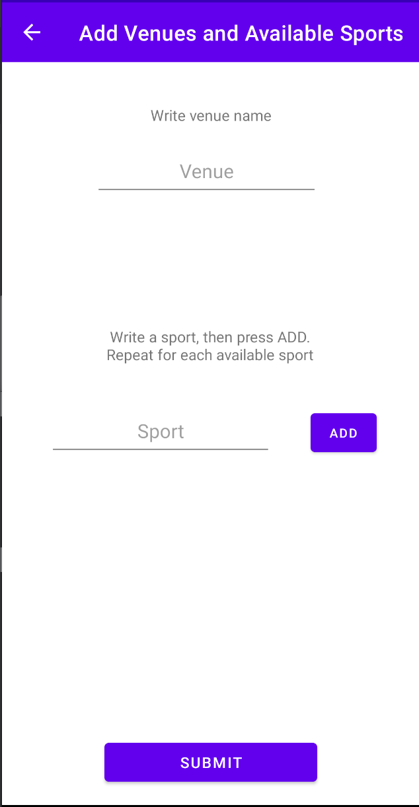
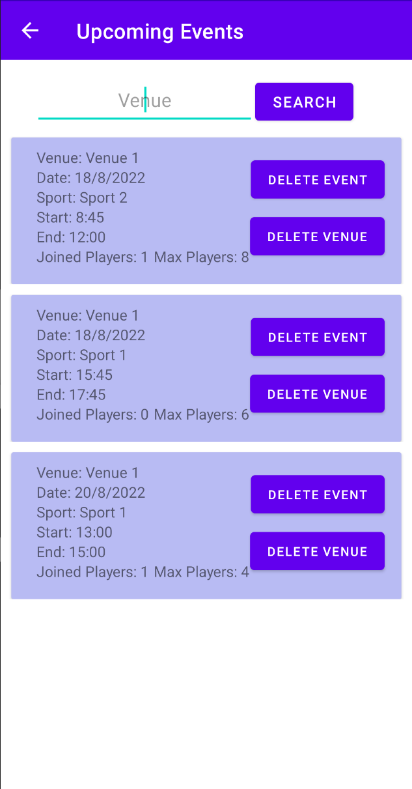

# Sports Event Scheduler

Final Project for the course *Software Design (CSCB07)* from the University of Toronto.

## Goal:

To develop an Android application, simulating a booking system, that allows admins to add locations/venues for which users can create/join sports events at these locations.

## Tools Used:
* Android Studio (Java)
* Firebase Realtime Database
* Git

## Screenshots:
### Login/Signup
<tr>
    <td>
        
    </td>
    <td>
        
    </td>
</tr>

### User Actions
<tr>
    <td>
        
    </td>
    <td>
        
    </td>
</tr>
<tr>
    <td>
        
    </td>
    <td>
        
    </td>
</tr>
<tr>
    <td>
        
    </td>
</tr>

### Admin Actions
<tr>
    <td>
        
    </td>
    <td>
        
    </td>
</tr>
<tr>
    <td>
        
    </td>
    <td>
        
    </td>
</tr>